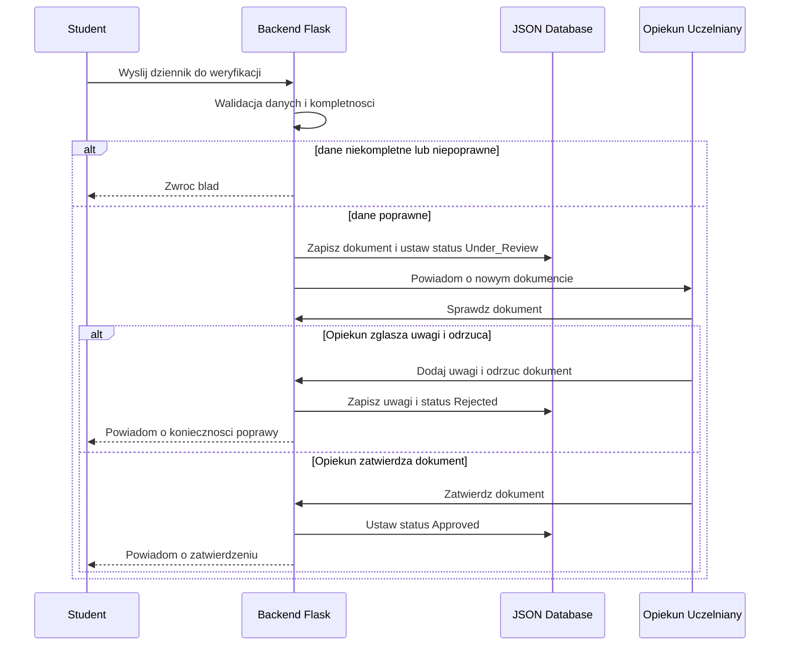
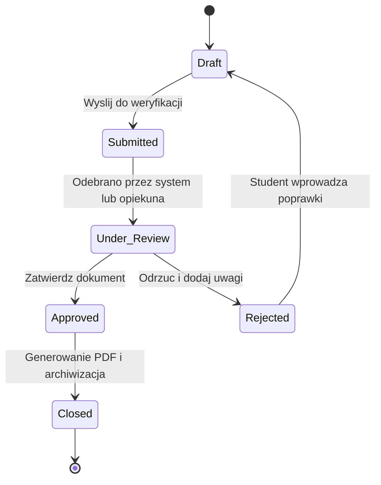
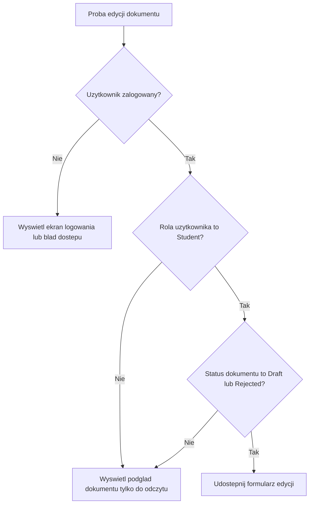
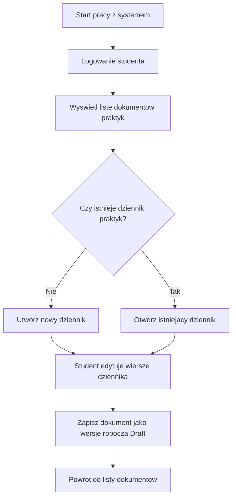
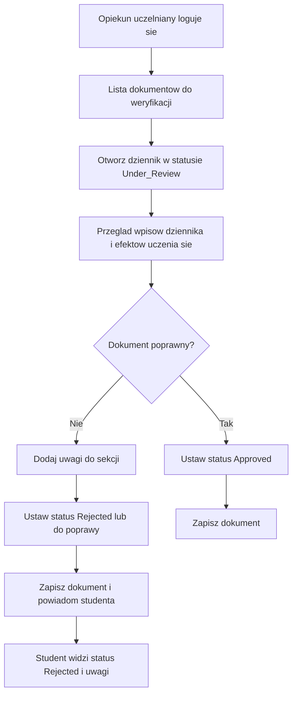
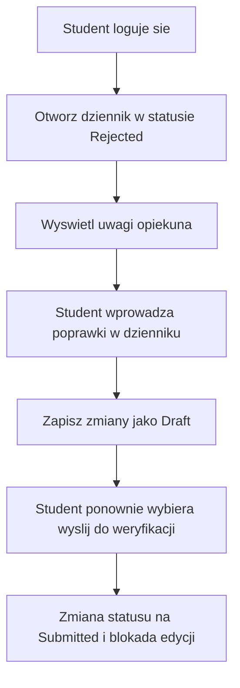
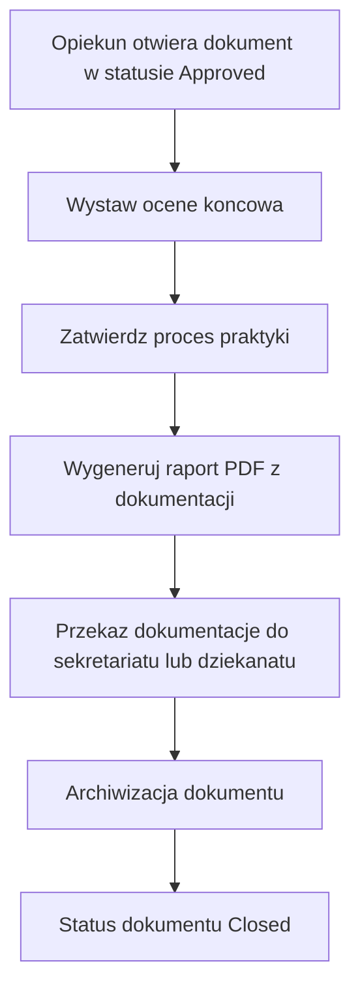

# Practice_management_system

Projekt przedstawiający wymagania oraz modele logiki biznesowej aplikacji do obsługi praktyk zawodowych. System wspiera cyfrowy obieg dokumentacji praktyk, w tym tworzenie i edycję dziennika, przesyłanie dokumentów do weryfikacji, obsługę uwag opiekunów, zmianę statusów dokumentów, generowanie raportu PDF oraz archiwizację. 

## Funkcje systemu

- rejestracja danych studenta, 
- edycja i zapis dziennika praktyk, 
- wysyłanie dokumentów do weryfikacji, 
- dodawanie uwag i zmiana statusów, 
- wystawienie oceny końcowej i generowanie PDF,
- archiwizacja dokumentacji. 

## Cel

Celem projektu jest przedstawienie przepływu danych, interakcji użytkowników i logiki biznesowej aplikacji wspierającej cyfrową obsługę praktyk zawodowych. 

## Aktorzy systemu

W projekcie uwzględniono cztery główne role użytkowników systemu: studenta, opiekuna uczelnianego, opiekuna zakładowego oraz sekretariat lub dziekanat. Role te wynikają bezpośrednio z analizy wymagań systemu obsługi praktyk zawodowych. 

- **Student** – uzupełnia dokumentację praktyk, edytuje dziennik, wysyła dokumenty do weryfikacji i śledzi ich status. 
- **Opiekun uczelniany** – weryfikuje dokumenty, dodaje uwagi, odsyła je do poprawy albo zatwierdza, a także wystawia ocenę końcową i inicjuje generowanie PDF. 
- **Opiekun zakładowy** – może potwierdzać przebieg praktyki i dodawać uwagi do dokumentacji. 
- **Sekretariat / dziekanat** – odpowiada za końcową obsługę formalną i archiwizację zatwierdzonych dokumentów. 

## Diagram sekwencji – weryfikacja dziennika praktyk

Diagram sekwencji przedstawia proces przesłania dziennika do weryfikacji, walidację danych po stronie backendu, zapis zmian w bazie JSON oraz decyzję opiekuna uczelnianego o odrzuceniu lub zatwierdzeniu dokumentu. Taki model odpowiada wymaganiom zadania 1 z laboratorium 5. 

## Diagram stanów – cykl życia dokumentu

Diagram stanów odwzorowuje cykl życia dokumentu praktyk od wersji roboczej do zamknięcia procesu. Uwzględnia on stany wymagane w treści laboratorium: Draft, Submitted, Under_Review, Rejected, Approved i Closed. 

Diagram pokazuje również powrót dokumentu do stanu Draft po odrzuceniu i zgłoszeniu uwag, co odpowiada workflow dokumentu opisanemu w wymaganiach projektu.

## Flowchart – logika uprawnień edycji

Ten flowchart odpowiada zadaniu 3 i pokazuje mechanizm kontroli dostępu podczas próby edycji dokumentu. Dokument może być edytowany wyłącznie przez zalogowanego studenta oraz tylko wtedy, gdy jego status to Draft lub Rejected. 

Model ten wynika z wymagania blokady edycji po wysłaniu dokumentu do weryfikacji oraz z rozróżnienia ról użytkowników i ich uprawnień.

## Flowchart – tworzenie i edycja dziennika

Ten scenariusz pokazuje podstawową ścieżkę pracy studenta z dokumentacją praktyk. Obejmuje logowanie, wejście do listy dokumentów, utworzenie nowego dziennika lub otwarcie istniejącego oraz zapis wersji roboczej. 

Diagram ten odpowiada funkcjom rejestracji danych studenta, edycji dziennika praktyk i powiązania dokumentów z użytkownikiem. 

## Flowchart – weryfikacja przez opiekuna

Ten diagram przedstawia proces przeglądu dokumentu przez opiekuna uczelnianego. Opiekun analizuje treść dokumentu i może albo zgłosić uwagi oraz odrzucić dokument, albo zatwierdzić go po pozytywnej weryfikacji. 

Scenariusz ten odpowiada wymaganiom dotyczącym pracy na formularzu efektów uczenia się, dodawania uwag i zmiany statusu dokumentu. 

## Flowchart – poprawa po odrzuceniu

Po odrzuceniu dokumentu student może ponownie otworzyć dokument, przeanalizować uwagi opiekuna, wprowadzić poprawki i jeszcze raz wysłać dokument do sprawdzenia. Taki przebieg wynika bezpośrednio z opisanego workflow dziennika praktyk.

Diagram pokazuje także, że status dokumentu ponownie przechodzi do etapu związanego z weryfikacją, a możliwość edycji zostaje ograniczona po wysłaniu dokumentu.

## Flowchart – finalizacja i archiwizacja

Końcowy etap procesu obejmuje zatwierdzenie dokumentacji, wystawienie oceny końcowej, wygenerowanie raportu PDF oraz przekazanie dokumentacji do archiwizacji. Taki przebieg odpowiada funkcjom F9, F10 i F12 z analizy wymagań. 

Diagram zamyka cały proces obsługi praktyk i odzwierciedla końcowy etap workflow dokumentu po pozytywnej weryfikacji przez opiekuna uczelnianego.

## Powiązanie z wymaganiami

Poniższa lista pokazuje, jak diagramy odnoszą się do wymagań funkcjonalnych systemu. Wymagania obejmują między innymi rejestrację danych studenta, edycję dziennika, przesyłanie do weryfikacji, dodawanie uwag, zmianę statusów, wystawienie oceny końcowej, generowanie PDF i archiwizację.

- **F1–F3** – tworzenie dokumentacji przez studenta i praca na dzienniku praktyk.
- **F4** – praca z efektami uczenia się podczas weryfikacji dokumentu.
- **F5–F8** – przesyłanie do weryfikacji, blokada edycji, uwagi opiekuna i zmiana statusów.
- **F9–F10** – wystawienie oceny końcowej i wygenerowanie raportu PDF.
- **F12** – archiwizacja zatwierdzonej dokumentacji.

## Podsumowanie projektu

Repozytorium prezentuje model logiki biznesowej systemu obsługi praktyk zawodowych za pomocą diagramów Mermaid osadzonych bezpośrednio w README. Takie rozwiązanie pozwala zachować czytelność dokumentacji, łatwość edycji oraz dobrą widoczność projektu na GitHubie bez potrzeby używania plików PNG lub zrzutów ekranu. [file:1][web:53][web:54]
