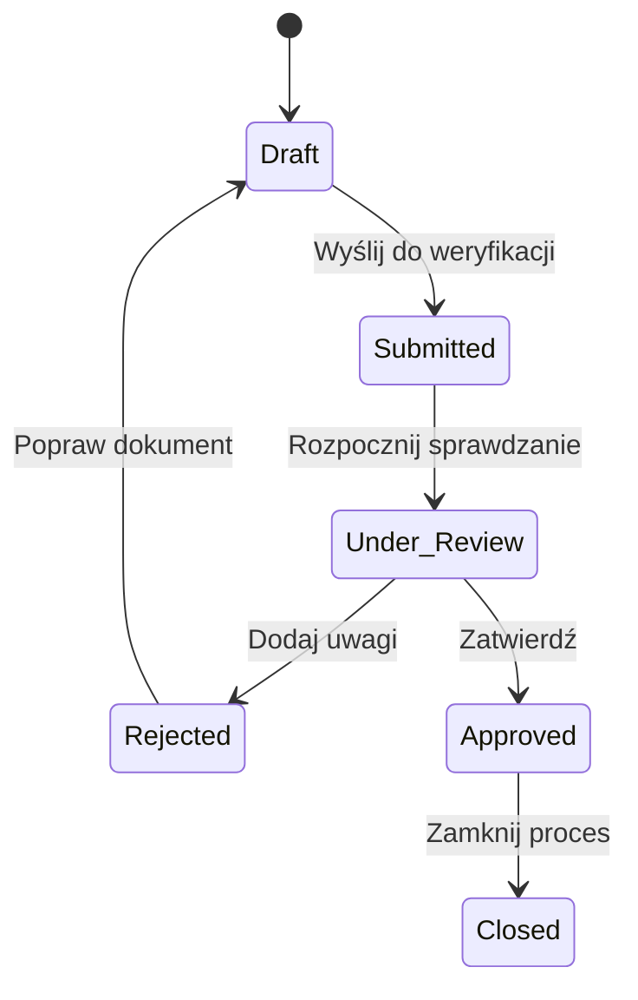

# Practice_management_system

Projekt przedstawiający wymagania oraz modele logiki biznesowej aplikacji do obsługi praktyk zawodowych. 

## Zakres
- diagram sekwencji weryfikacji dziennika praktyk, 
- diagram stanów dokumentu praktyk, 
- flowchart logiki uprawnień edycji, 
- flowcharty scenariuszy użycia zgodnych z wymaganiami systemu. 

## Funkcje systemu
- rejestracja danych studenta, 
- edycja i zapis dziennika praktyk, 
- wysyłanie dokumentów do weryfikacji, 
- dodawanie uwag i zmiana statusów, 
- wystawienie oceny końcowej i generowanie PDF,
- archiwizacja dokumentacji.

## Narzędzia
- Mermaid, 
- Markdown,
- GitHub. 

## Cel
Celem projektu jest przedstawienie przepływu danych, interakcji użytkowników i logiki biznesowej aplikacji wspierającej cyfrową obsługę praktyk zawodowych. 
## Diagram stanów dokumentu

